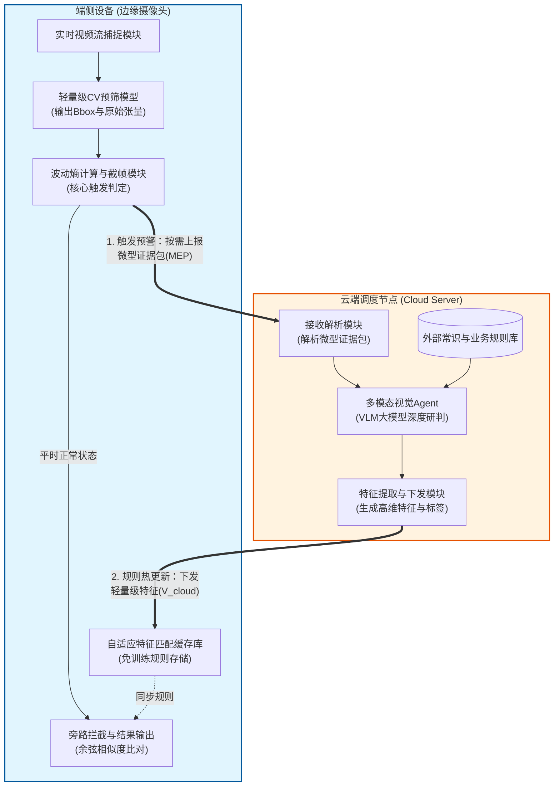

```mermaid
flowchart TB
    subgraph Edge["端侧设备 (边缘摄像头)"]
        direction TB
        Camera["实时视频流捕捉模块"]
        SmallModel["轻量级CV预筛模型\n(输出Bbox与原始张量)"]
        EntropyCalc["波动熵计算与截帧模块\n(核心触发判定)"]
        LocalCache["自适应特征匹配缓存库\n(免训练规则存储)"]
        Bypass["旁路拦截与结果输出\n(余弦相似度比对)"]
        
        Camera --> SmallModel
        SmallModel --> EntropyCalc
        EntropyCalc --"平时正常状态"--> Bypass
    end

    subgraph Cloud["云端调度节点 (Cloud Server)"]
        direction TB
        Receiver["接收解析模块\n(解析微型证据包)"]
        Agent["多模态视觉Agent\n(VLM大模型深度研判)"]
        KnowledgeBase[("外部常识与业务规则库")]
        FeatureExtractor["特征提取与下发模块\n(生成高维特征与标签)"]
        
        Receiver --> Agent
        KnowledgeBase --> Agent
        Agent --> FeatureExtractor
    end

    %% 端云交互连线
    EntropyCalc == "1. 触发预警：按需上报\n微型证据包(MEP)" ===> Receiver
    FeatureExtractor == "2. 规则热更新：下发\n轻量级特征(V_cloud)" ===> LocalCache
    LocalCache -. "同步规则" .-> Bypass

    classDef edgeStyle fill:#e1f5fe,stroke:#01579b,stroke-width:2px;
    classDef cloudStyle fill:#fff3e0,stroke:#e65100,stroke-width:2px;
    class Edge edgeStyle;
    class Cloud cloudStyle;
```